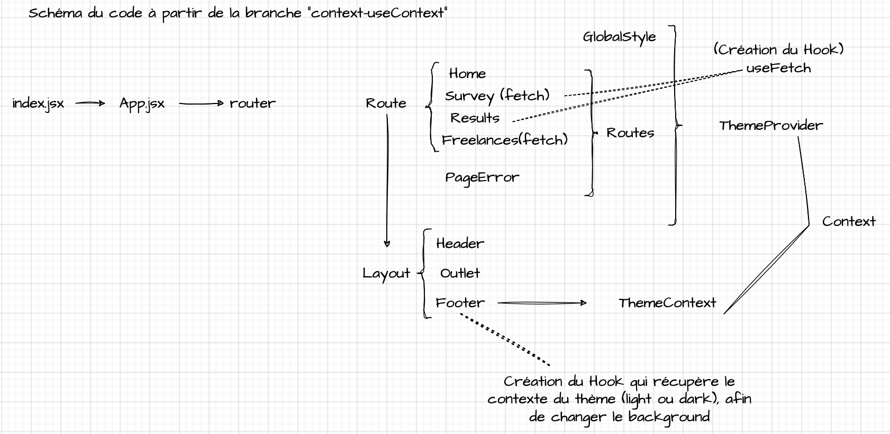

# Shiny
https://openclassrooms.com/fr/courses/7150606-creez-une-application-react-complete
 
**Skills developed**:
- Build a complete Single Page Application that respects a robust architecture;
- Master the hooks;
- Test a React application;
- Evolve in a codebase that uses class components.
##
## Project branches:

- "structureFiles-proptypes-styledComponents" branch: 
:point_right: [here](https://github.com/cla31/Shiny/tree/structureFiles-proptypes-styledComponents) 
- "mockup-figma" branch: 
:point_right: [here](https://github.com/cla31/Shiny/tree/mockup-figma) 
- "useState-useEffect" branch: 
:point_right: [here](https://github.com/cla31/Shiny/tree/useState-useEffect) 
- "state-loading" branch: 
:point_right: [here](https://github.com/cla31/Shiny/tree/state-loading) 
- "fetch-freelance-profiles" branch: 
:point_right: [here](https://github.com/cla31/Shiny/tree/fetch-freelance-profiles) 
- "context-useContext" branch: 
:point_right: [here](https://github.com/cla31/Shiny/tree/context-useContext) 
- "create-hook" branch: 
:point_right: [here](https://github.com/cla31/Shiny/tree/create-hook) 
- "test-jest" branch: 
:point_right: [here](https://github.com/cla31/Shiny/tree/test-jest) 
- "react-testing-library" branch: 
:point_right: [here](https://github.com/cla31/Shiny/tree/react-testing-library) 
- "old-react-syntax" branch: 
:point_right: [here](https://github.com/cla31/Shiny/tree/old-react-syntax) 
##
## Additional information:
From the "useState-useEffect" branch, launch the API locally, for that :
1. Make a `git clone https://github.com/OpenClassrooms-Student-Center/7150606-API-React-intermediate.git`
2. Install `node_modules` with `yarn`
3. Run the API with `yarn start`
## Consuming the API
The Shiny API is a REST API. If you have any doubts about what a REST API is, do not hesitate to take a look at the excellent course [Adoptez les API REST pour vos projets web. 
](https://openclassrooms.com/fr/courses/6573181-adoptez-les-api-rest-pour-vos-projets-web). 

Once launched, this API makes several routes available to you:

- The route to recover the profiles of freelancers:
`GET /freelancers`

- The route to get the details of a freelance profile:
`GET /profile/?id={id}`

- The route to get the questionnaire:
`GET /survey/`

- The route to obtain the result of the questionnaire:
`GET /results/?a1={answer1}&a2={answer2}&a3={answer3}...`

##
## Code architecture:
##

